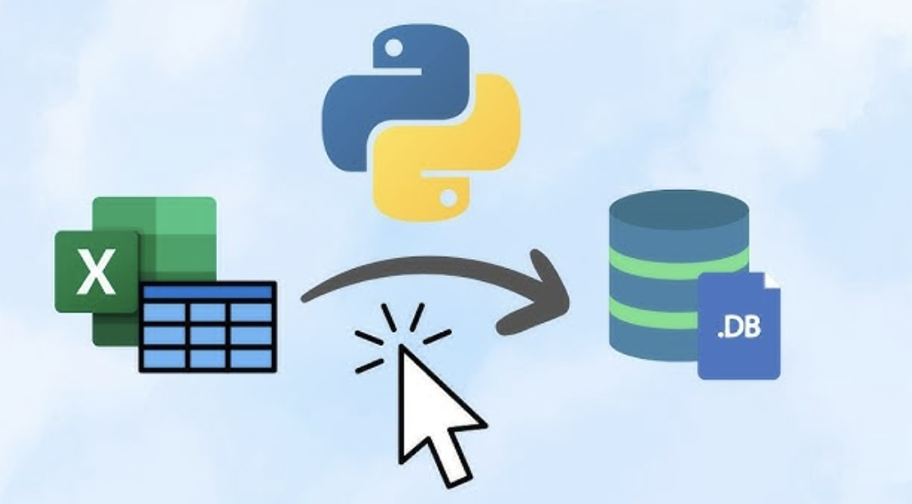
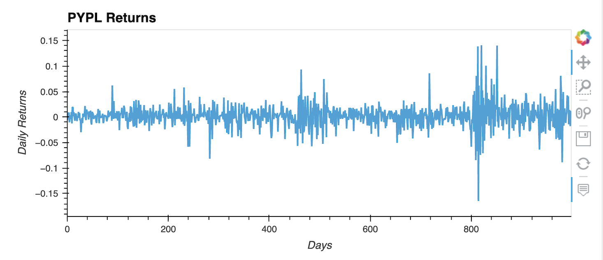
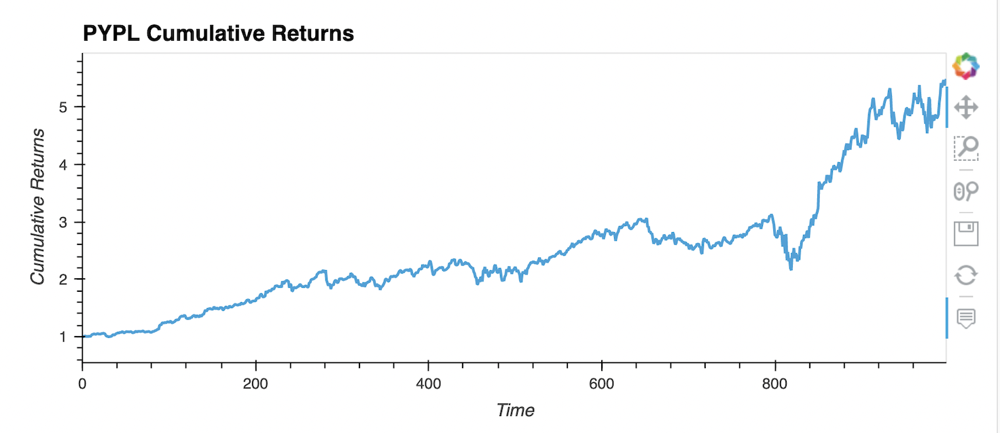

# Financial_Databases_SQL




image from (Source)[https://www.youtube.com/watch?v=GIO7hWAVRzU]

# Table of Contents

<div align="center">
   
   [Installation](#installation)
   
</div>

   
This project is built in Jupyter Notebook. If you don’t have Jupyter installed, you can follow the instructions [here](https://jupyterlab.readthedocs.io/en/stable/getting_started/installation.html) to set it up.

### Required Libraries

You can also install all the necessary libraries by using the provided `requirements.txt` file. To install the dependencies, follow these instructions below:

-  Download the `requirements.txt` file included in the project repository.
-  Open a terminal and navigate to the project directory where the `requirements.txt` file is located.
-  Run the following command to install all the required packages below:

   ```bash
   pip install -r requirements.txt
   ```

This will install the following libraries in Jupyter:
- **`numpy`**: For numerical computations.
- **`pandas`**: For data manipulation and DataFrame operations.
- **`hvplot`**: For creating interactive visualizations.
- **`sqlalchemy`**: For connecting and interacting with the SQL database.

### Manually Installing Specific Libraries (As Needed)

If you'd like to manually install any missing libraries, here are the installation commands:

- [**SQLAlchemy**](https://www.sqlalchemy.org/):
   
  ```bash
  pip install SQLAlchemy
  ```
- [**Voilà**](https://github.com/voila-dashboards/voila):
  
  ```bash
  conda install -c conda-forge voila
  ```
---


# Background

In this project, we create a financial database and web application to analyze the performance of a hypothetical FinTech Exchange-Traded Fund (ETF). Built with SQL, Python, and the Voilà library, the application focuses on four stocks in the ETF: __GDOT__ (Green Dot Corporation), __GS__ (Goldman Sachs), __PYPL__ (PayPal Holdings), and __SQ__ (Block, formerly Square). Each stock has a dedicated table in the etf.db database, with data sourced from the Yahoo Finance API.

The analysis examines daily returns for each individual stock specifically focuing on __PYPL__ as well as the overall ETF performance. After completing the analysis, visualizations are deployed as a web application using the Voilà library, which transforms the Jupyter Notebook into an interactive web interface.


<div align="center">
   
  [Basic Usage](#basic-usage)
   
</div>
   

  ---

## PPYL Retuns 



Used hvPlot to create an interactive visualization for the __PYPL__ daily returns and reflected the “time” column of the DataFrame on the x-axis.

---
## PYPL Cumulative Returns



Used hvPlot to create an interactive visualization for the __PYPL__ cumulative returns. Reflect the “time” column of the DataFrame on the x-axis.

---

## ETF Cumulative Returns


Used hvPlot to create an interactive line plot that visualizes the cumulative return values of the __ETF__ portfolio. Reflect the “time” column of the DataFrame on the x-axis.

---


 <div align="center">
   
   [Source Code](https://github.com/kelvinkissi/Financial-Databases-SQL/blob/main/etf_analyzer.ipynb)
   
</div>

-----

# Project Outline

The project is organized into several main sections:

Data Population in SQL Database

We start by preparing the dataset. This includes defining the tickers that compose the Fintech ETF and populating a SQL database with market data using the Yahoo Finance API. Then, we add daily returns to this database. The functions for these tasks are stored in utils.py.

Single Asset Analysis in the ETF

This section focuses on analyzing an individual stock within the ETF. Here, we calculate daily returns, visualize the stock's performance, and evaluate its contribution to the overall ETF.

Enhanced Data Access with Advanced SQL Queries

In this part, we optimize data retrieval by writing advanced SQL queries. This improves data access efficiency, which is critical for handling large datasets effectively.

ETF Portfolio Analysis

We analyze the ETF as a combined portfolio by aggregating data from all four stocks. This includes calculating overall daily returns and generating insights into the ETF's overall performance.

Creating a New Database for Equal-Weighted ETF Returns

To maintain the integrity of the original data, we create a new database to store daily returns for an equally weighted ETF. This approach preserves the original etf.db database for additional analysis.

Notebook Deployment as a Web Application

Finally, we deploy the Jupyter Notebook as a web application using the Voilà library. This enables users to explore ETF data and visualizations interactively through a browser interface.
